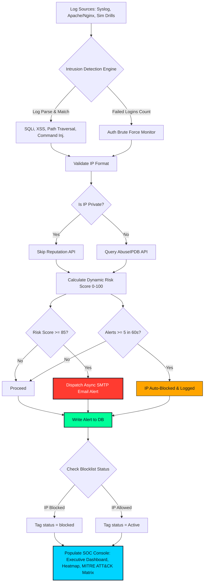

# SentinelShield Setup & Deployment Guide

This guide provides complete instructions to set up and run the SentinelShield Security Operations Center (SOC) dashboard locally, both with and without Docker.

---

## System Architecture & Data Workflow



### Working Procedure
1. **Log Ingestion**: Log telemetry is fed either through Nginx/Apache logs via the `/api/ingest-logs` endpoint, the background security simulator, or manual drill triggers.
2. **Analysis & Matching**: The parsing pipeline extracts source IP addresses and runs them against threat patterns (using regex) to detect malicious activities.
3. **Intel Integration**: Non-private IPs are checked against AbuseIPDB's intelligence feed to calculate confidence scoring.
4. **Risk Calculation**: Calculates threat scores based on attack types, frequency, off-hours execution, and AbuseIPDB inputs.
5. **Mitigation & Alerts**: 
   - IPs exceeding 5 alerts in 60 seconds are automatically blocked.
   - High-severity incidents ($\ge 85$) trigger instant out-of-band email notifications.
6. **SOC Dashboards**: Active threats illuminate corresponding MITRE ATT&CK cells and appear on the Live Map.

---

## 1. Prerequisites

### For running without Docker (Local Development):
* **Python**: Python 3.9 or higher (Python 3.11 is recommended).
* **Node.js**: Node.js 18 or higher (Node 20 LTS is recommended).
* **Package Manager**: `npm` (packaged with Node.js) or `yarn`.

### For running with Docker (Containerized Deployment):
* **Docker**: Docker Engine 20.10+ or Docker Desktop installed and running.
* **Docker Compose**: Docker Compose v2.0+ (typically bundled with Docker Desktop).

---

## 2. Installation Steps

1. Navigate to the project root directory containing the project components:
   ```
   sentinelshield/
   ├── backend/
   ├── frontend/
   ├── docs/
   ├── docker-compose.yml
   └── README.md
   ```
2. Open two terminal instances if running manually: one for the Flask backend, and one for the React frontend.

---

## 3. Environment Variables

The backend reads configuration from environment variables. If running locally, you can create a `.env` file inside the `backend/` folder, or let the application fallback to default development settings.

| Variable Name | Description | Default Value (Development) |
| :--- | :--- | :--- |
| `SECRET_KEY` | Flask application secret key for sessions | `sentinelshield-super-secret-key-12345` |
| `JWT_SECRET` | Secret key used to encrypt and sign JWT tokens | `sentinelshield-jwt-secret-key-54321` |
| `USE_POSTGRES` | Flag to force PostgreSQL database connection | `false` (falls back to SQLite locally) |
| `POSTGRES_USER` | PostgreSQL user account name | `postgres` |
| `POSTGRES_PASSWORD` | PostgreSQL user access password | `admin123` |
| `POSTGRES_HOST` | Database host service address | `localhost` |
| `POSTGRES_PORT` | PostgreSQL port | `5432` |
| `POSTGRES_DB` | Database name | `sentinelshield` |
| `SIMULATOR_ENABLED` | Toggle background attack log simulation | `true` |
| `SIMULATOR_INTERVAL`| Delay in seconds between simulated attack events | `5` |

---

## 4. Database Setup

The backend uses **SQLAlchemy ORM** and automatically initializes the database tables and data seeds upon startup.

* **SQLite Fallback**: In local non-docker mode, the application automatically initializes a SQLite database at `backend/instance/sentinelshield.db`. You do not need to pre-create any database file.
* **PostgreSQL (Docker Mode)**: The `docker-compose.yml` file configures a PostgreSQL container. The database container will launch first, and the backend container will wait for it to be accessible, then automatically create all schema structures and seed tables.

### Manual Database Re-Seeding
If you want to clear current telemetry and re-seed the default logs, delete the SQLite file (local dev) and start the backend:
```powershell
Remove-Item -Force backend/instance/sentinelshield.db
```

---

## 5. Docker Deployment Commands

Run the full multi-tier production stack (PostgreSQL + Flask + Nginx React Frontend):

### A. Start the containers (Builds on first run)
```bash
docker-compose up --build
```
*The React frontend will be accessible on production port `http://localhost:80`, and the Flask backend on `http://localhost:5000`.*

### B. Run containers in the background (Detached mode)
```bash
docker-compose up -d
```

### C. Stop and tear down the containers
```bash
docker-compose down
```

### D. View container logs
```bash
docker-compose logs -f
```

---

## 6. Manual Flask Backend Startup

Run the API server manually using SQLite:

1. Navigate to the backend directory:
   ```bash
   cd backend
   ```
2. Create and activate a Python virtual environment:
   ```bash
   # Windows
   python -m venv venv
   .\venv\Scripts\activate

   # Linux/macOS
   python3 -m venv venv
   source venv/bin/activate
   ```
3. Install the dependencies:
   ```bash
   pip install -r requirements.txt
   ```
4. Start the backend:
   ```bash
   python app.py
   ```
   *The console will print out seeding confirmations and bind the REST API to `http://localhost:5000`.*

---

## 7. Manual React Frontend Startup

Run the Vite hot-reloading dev server:

1. Navigate to the frontend directory:
   ```bash
   cd frontend
   ```
2. Install the node packages:
   ```bash
   npm install
   ```
3. Start the dev server:
   ```bash
   npm run dev
   ```
   *The console will initialize Vite and display the local development link, typically `http://localhost:5173`.*

---

## 8. Default Credentials

The database is pre-seeded with four default operator roles:

| Username | Password | Role | Access Level |
| :--- | :--- | :--- | :--- |
| `admin` | `admin123` | **Administrator** | Full configuration, dashboard rules, and simulation triggers. |
| `analyst` | `analyst123` | **SOC Analyst** | Standard dashboard charts, map inspection, and log monitoring. |
| `responder` | `responder123`| **Incident Responder** | Workloads tracking, incident containment notes, and ticket closing. |
| `engineer` | `engineer123` | **Security Engineer** | Threat intelligence updates, blocklist insertions, and simulation drills. |

---

## 9. Troubleshooting Guide

### A. CORS Blockings / API Failures
* **Symptom**: Frontend console logs errors like `Access to fetch at ... has been blocked by CORS policy`.
* **Fix**: Ensure that the Flask backend is running on `http://localhost:5000`. The frontend requests are hardcoded to talk to port `5000` in development. Check that `flask-cors` is installed and initialized in `app.py`.

### B. Address Already in Use (Port Conflicts)
* **Symptom**: Backend fails to start with `OSError: [Errno 98] Address already in use`.
* **Fix**: Another process is occupying port `5000` (common on macOS where AirPlay uses port 5000). Kill the process occupying port 5000, or modify the port binding in `backend/app.py` and the fetch URL in frontend code.

### C. PowerShell Script Execution Disabled (Windows)
* **Symptom**: Attempting to run `npm` or `npx` throws security exceptions in PowerShell.
* **Fix**: Run PowerShell as Administrator and execute the bypass command:
  ```powershell
  Set-ExecutionPolicy -ExecutionPolicy Bypass -Scope Process
  ```

### D. Docker Volume Mount Permissions
* **Symptom**: Database container exits repeatedly with file permission errors.
* **Fix**: Clean your docker containers and volumes using `docker volume prune` or restart Docker Desktop.

---

## 10. Verification Checklist

To confirm all modules of SentinelShield are operating correctly, walk through this 5-step checklist:

1. **Circular Posture & KPI Verification**:
   * **Action**: Log in as `admin`. Check the **Executive Dashboard**.
   * **Verification**: The circular Security Posture score should render (e.g. `92`). MTTD and MTTR cards should display numbers (e.g., MTTR: `34.0m`).
2. **Heatmap & Timeline Verification**:
   * **Action**: Navigate to **Map & Timeline**.
   * **Verification**: Check that countries like the *United States*, *Germany*, and *China* are highlighted in cyan, orange, or red. Verify that active coordinates are plotted. In the timeline, pick a filter (e.g. category "SQL Injection") and click a timeline card; a detailed inspect panel should slide open on the right.
3. **MITRE ATT&CK Matrix Verification**:
   * **Action**: Navigate to **MITRE Matrix**.
   * **Verification**: Verify that technique cells with active alerts glow (e.g. `Brute Force T1110.001` glowing orange or red). Click the cell and check that the drawer displays corresponding alerts. Verify that the frequency bar chart below displays the statistics.
4. **Analyst Dashboard Verification**:
   * **Action**: Navigate to **Analyst Performance**.
   * **Verification**: Verify that the leaderboard table displays statistics for `responder`, `analyst`, and other users (showing resolved ticket counts and MTTR averages). Confirm the active workload doughnut chart displays the distribution.
5. **Manual Threat Drill Injection**:
   * **Action**: Navigate to **System Settings**. Under *Cyber Security Drills*, click **SQL Injection** or **Port Scan**.
   * **Verification**: A banner should declare success. Immediately switch to **Map & Timeline** or **Alert Manager**; the injected attack should be plotted on the heatmap and timeline instantly.
