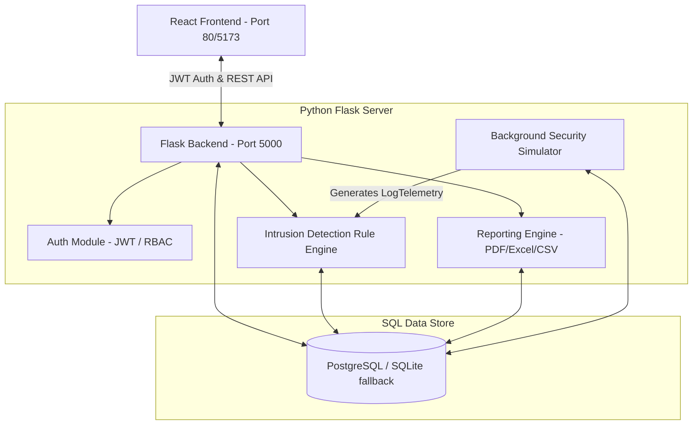

# SentinelShield Architecture & ER Diagrams

This document outlines the system architecture and database schemas of SentinelShield.

## System Architecture

SentinelShield is structured as a decoupled client-server architecture with an integrated real-time threat simulator and log analysis rule engine.



---

## Database ER Diagram

The database is built using SQLAlchemy models. The relationship diagram details the schemas and primary/foreign key connections.

```mermaid
erDiagram
    users {
        int id PK
        string username UNIQUE
        string email UNIQUE
        string password_hash
        string role
        datetime created_at
        datetime last_login
    }
    
    incidents {
        int id PK
        string title
        text description
        string status
        string severity
        int assignee_id FK
        datetime created_at
        datetime updated_at
        text containment_strategy
        text resolution_notes
    }
    
    alerts {
        int id PK
        string title
        text description
        string severity
        string category
        string source_ip
        string destination_ip
        string status
        string mitre_technique
        datetime created_at
        int incident_id FK
    }
    
    threat_intelligence {
        int id PK
        string indicator_type
        string value UNIQUE
        int reputation_score
        string source_feed
        string threat_category
        text description
        datetime created_at
    }
    
    log_entries {
        int id PK
        datetime timestamp
        string log_source
        text message
        string severity
        text raw_data
        boolean is_malicious
        string correlation_id
    }
    
    notifications {
        int id PK
        string message
        string notification_type
        boolean is_read
        datetime created_at
    }
    
    reports {
        int id PK
        string name
        string report_type
        string generated_by
        datetime created_at
        string file_path
        string file_format
    }
    
    attack_events {
        int id PK
        string type
        string source_ip
        string country
        string city
        float latitude
        float longitude
        text payload
        datetime timestamp
    }
    
    system_settings {
        int id PK
        string key UNIQUE
        string value
        datetime updated_at
    }

    users ||--o{ incidents : "manages/investigates"
    incidents ||--o{ alerts : "consolidates/links"
```
